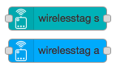
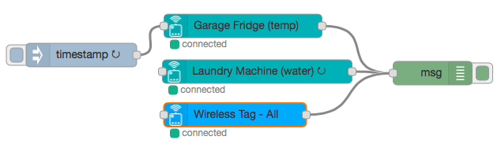

[](https://travis-ci.org/hlapp/node-red-contrib-wirelesstag)
[](https://www.npmjs.com/package/node-red-contrib-wirelesstag)
[](https://www.npmjs.com/package/node-red-contrib-wirelesstag)
[](https://david-dm.org/hlapp/node-red-contrib-wirelesstag)
[](https://david-dm.org/hlapp/node-red-contrib-wirelesstag?type=dev)

# node-red-contrib-wirelesstag



Two nodes (_wirelesstag-s_ and _wirelesstag-a_) for [Node-RED] that access
[Wireless Sensor Tags] and their sensors. One (_wirelesstag-s_) represents an
individual sensor on a specified tag, and will output data from only that
sensor. The other node (_wirelesstag-a_) represents the whole collection of
tags (and thus their sensors) accessible to the authenticated account. It
outputs data for any tag (and all its sensors) reported by the API server as
having an update available.



Nodes communicate with the [Wirelesstag JSON Web Service API] using the
[wirelesstags] NodeJS package.

## Prerequisites

To connect these nodes, you must have an account with a Wirelesstag
server. The server can be the one hosted by the vendor, or a
self-hosted one; the base URI for the API endpoint can be configured
if different from the default.

Instead of using the credentials of your "main" account, it is highly
recommended to create a separate service account as a "limited user"
for authenticating through this package.
([Reasons](https://github.com/hlapp/wirelesstags-js#installation-and-setup).)
Because tags can be made visible to or removed from a "limited user" account
dynamically, this also allows filtering at the server-level which tags are
accessible to a Node-RED flow to begin with.

## Installation

Run the follwing command in the root directory of your Node-RED installation.
Usually this is `~/.node-red`.

```
$ npm install node-red-contrib-wirelesstag
```

This should also install the dependencies.

## Usage

For each node, the following parameters are configurable:

* The API connection (email, password, and base URI for the JSON
  Web API server).
* (Optional) The message topic, or a topic prefix. If left empty, the topic
  is auto-generated.
* (Optional) A name for the node. If left empty, the name is
  auto-generated from the tag and sensor names.

For _wirelesstag-s_ nodes, the following are also available:

* The tag manager, tag, and sensor for which to report data. The lists
  of available choices are auto-populated.
* Whether to auto-update the tag's attribute and sensor data from the server.
  Default is yes. If disabled, the input capability (see below) must be used
  to trigger data updates.

### Output

Both nodes send messages with the following properties and structure (aside
from `topic`):

* `msg.payload` with properties `sensor` (the kind of sensor), `reading`
  (the sensor's current reading), `eventState` (the current state, such as
  _Normal_, _Too High_, etc), and `armed` (true if the sensor is armed and
  false otherwise).
* `msg.sensorConfig`: the properties of the monitoring configuration
  for the sensor, will depend on the sensor.
* `msg.tag`: additional properties of the tag (`name`, `uuid`,
  `slaveId`, `alive`, and `updateInterval`).
* `msg.tagManager`: additional properties of the tag manager with
  which the tag is associated (`name`, `mac`, and `online`).

A _wirelesstag-s_ node will send these only for the sensor it is configured
for, whereas a _wirelesstag-a_ node will send this message for each sensor of
the tag that the server (see below) reports has having updated attribute or
sensor data available. If only some tags and/or sensors are of interest
in a flow, other nodes (such as _switch_) will need to be used to filter
the output of a _wirelesstag-a_ node.

The nodes use a polling API endpoint to continuously poll for updates.
(This is the same mechanism as the [Wirelesstag web-application]
uses.) How frequently new data becomes available for which tag is
determined by the update interval configured for each tag (and can
thus be changed using the Wirelesstag native web or mobile apps).

### Input

When connected on input, both nodes inspect `msg.payload` properties to
either "actuate" the matching tag and/or sensor (by modifying their properties),
or to request a tag data update from the server (or from the physical tag
itself). Properties to be modified must be in the same structure, and their
new value of the same type, as they are output by the node. The following
properties are recognized:

* `armed`: arm the sensor if true, and disarm otherwise.
* `tag.updateInterval`: set the update interval for the tag.
* `sensorConfig.*`: set the corresponding sensor configuration
  properties.
* `immediate`: if `true` and triggering a data update, force an immediate
  update from the physical tag. (This defaults to `true` for _wirelesstag-a_
  nodes.)

Desired payloads can, for example, be injected with the _inject_ node,
or created and set with the _change_ node. For example, the following
as JSON-format payload for the _inject_ node will change the notification
sound for the sensor:

```js
{ "sensorConfig": { "notifySettings": { "sound": "moof" } } }
```

In the _change_ node, choose "msg." from the selector and the following
expression for specifying the property:

```js
sensorConfig.notifySettings.sound
```

A data update from the server is triggered if the `msg.payload` received on
input does not contain a property for actuating the sensor or tag. If the
tag attribute and data returned from the server differ from those received
previously, it will generate one (_wirelesstag-s_) or more (_wirelesstag-a_)
messages on output.

### Caveats and limitations

* Auto-populating the dropdowns for the tag manager, tag, and sensor
  selection requires a live connection made through the [wirelesstags]
  API. Due to the way the Node-RED editor works, this isn't available
  until the respective cloud API configuration node is _deployed_.
  Hence, when setting up a node with a new cloud API configuration,
  the node _must_ first be deployed. For _wirelesstag-s_ nodes, configuration
  can then be resumed.
* In principle each event (such as motion detected, temperature too
  high, etc) for armed sensors should result in data becoming
  available for the corresponding tag shortly thereafter. In practice,
  this does not always seem to be the case, in particular for the
  event of returning to "normal".
* The [wirelesstags] library currently only supports username/password
  authentication, and hence so does this node.
* Even though the configuration interface allows multiple API
  connections to be configured, all tags will at present use the same
  API connection (normally the first one), because the [wirelesstags]
  library cannot currently switch between sessions using different
  sets of credentials.

## How to support

Aside from reporting issues and contributing pull requests, if you
plan to buy from Wireless Sensor Tags, you might consider using
[this link](https://goo.gl/GxwQbZ) to their website. If more than 10
people do so, and some end up buying, I stand to receive a discount on
a past purchase of mine, which will allow me to buy other types of
tags in the future and support those too.

## Credits

The icon is derived from the ["Wifi" icon by Peter Borges] of The Noun
Project.

## License

Available under the [MIT License](LICENSE).

[Node-RED]: https://nodered.org
[Wireless Sensor Tags]: http://wirelesstag.net
[Wirelesstag web-application]: https://wirelesstag.net/eth/
[Wirelesstag JSON Web Service API]: http://mytaglist.com/media/mytaglist.com/apidoc.html
[wirelesstags]: https://github.com/hlapp/wirelesstags-js
["Wifi" icon by Peter Borges]: https://thenounproject.com/term/iot/362213/
